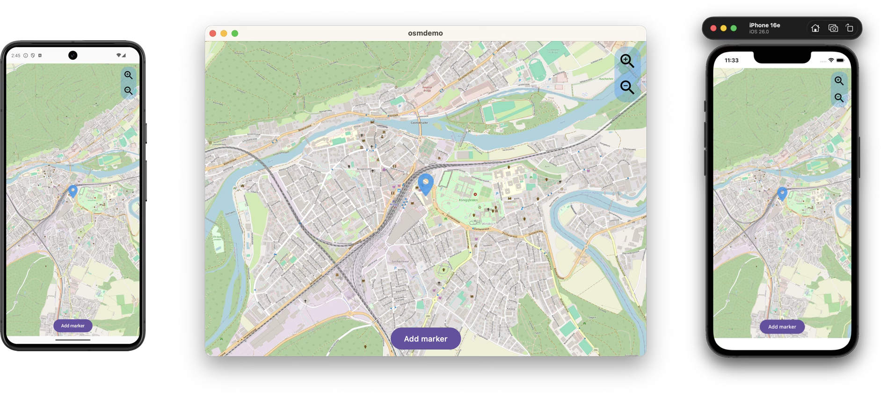

# OSMDemo based on MapComposeMP

This project uses and is based on examples from [MapComposeMP](https://github.com/p-lr/MapComposeMP.git).

MapComposeMP is a fast, memory-efficient compose multiplatform library to display tiled maps with minimal effort. It shows the visible part of a tiled map with support of markers and paths, and various gestures (flinging, dragging, scaling, and rotating). Target platforms are iOS, desktop (Windows, macOS, Linux), Android, and WebAssembly.

Many thanks to Pierre Laurence, the originator of MapCompose.

This project shows how to display [OpenStreetMap](https://www.openstreetmap.org/)-Tiles in your application and how to deal with markers and callouts.

It uses a file-system cache for the OSM-tiles.




# Kotlin Multiplatform

This is a Kotlin Multiplatform project targeting Android, iOS, Desktop (JVM).

* [/composeApp](./composeApp/src) is for code that will be shared across your Compose Multiplatform applications.
  It contains several subfolders:
    - [commonMain](./composeApp/src/commonMain/kotlin) is for code that’s common for all targets.
    - Other folders are for Kotlin code that will be compiled for only the platform indicated in the folder name.
      For example, if you want to use Apple’s CoreCrypto for the iOS part of your Kotlin app,
      the [iosMain](./composeApp/src/iosMain/kotlin) folder would be the right place for such calls.
      Similarly, if you want to edit the Desktop (JVM) specific part, the [jvmMain](./composeApp/src/jvmMain/kotlin)
      folder is the appropriate location.

* [/iosApp](./iosApp/iosApp) contains iOS applications. Even if you’re sharing your UI with Compose Multiplatform,
  you need this entry point for your iOS app. This is also where you should add SwiftUI code for your project.

### Build and Run Android Application

To build and run the development version of the Android app, use the run configuration from the run widget
in your IDE’s toolbar or build it directly from the terminal:

- on macOS/Linux
  ```shell
  ./gradlew :composeApp:assembleDebug
  ```
- on Windows
  ```shell
  .\gradlew.bat :composeApp:assembleDebug
  ```

### Build and Run Desktop (JVM) Application

To build and run the development version of the desktop app, use the run configuration from the run widget
in your IDE’s toolbar or run it directly from the terminal:

- on macOS/Linux
  ```shell
  ./gradlew :composeApp:run
  ```
- on Windows
  ```shell
  .\gradlew.bat :composeApp:run
  ```

### Build and Run iOS Application

To build and run the development version of the iOS app, use the run configuration from the run widget
in your IDE’s toolbar or open the [/iosApp](./iosApp) directory in Xcode and run it from there.

---

Learn more about [Kotlin Multiplatform](https://www.jetbrains.com/help/kotlin-multiplatform-dev/get-started.html)…